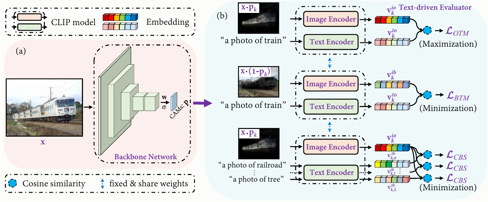

# CLIMS

Code repository for our paper "[CLIMS: Cross Language Image Matching for Weakly Supervised Semantic Segmentation](https://openaccess.thecvf.com/content/CVPR2022/html/Xie_CLIMS_Cross_Language_Image_Matching_for_Weakly_Supervised_Semantic_Segmentation_CVPR_2022_paper.html)" in **CVPR 2022**.

:heart_eyes: Code for our
paper "[CCAM: Contrastive learning of Class-agnostic Activation Map for Weakly Supervised Object Localization and Semantic Segmentation](https://openaccess.thecvf.com/content/CVPR2022/html/Xie_C2AM_Contrastive_Learning_of_Class-Agnostic_Activation_Map_for_Weakly_Supervised_CVPR_2022_paper.html)"
in **CVPR 2022** is also available [here](https://github.com/CVI-SZU/CCAM).



**Please to NOTE that this repository is an **improved version** of our camera-ready version (you can refer to the directory of `previous_version/`). We recommend to use our improved version of CLIMS instead of camera-ready version.**


## Dataset
### PASCAL VOC2012
You will need to download the images (JPEG format) in PASCAL VOC2012 dataset from [here](http://host.robots.ox.ac.uk/pascal/VOC/voc2012/) and train_aug ground-truth can be found [here](http://home.bharathh.info/pubs/codes/SBD/download.html). Make sure your `data/VOC2012 folder` is structured as follows:
```
├── VOC2012/
|   ├── Annotations
|   ├── ImageSets
|   ├── SegmentationClass
|   ├── SegmentationClassAug
|   └── SegmentationObject
```
### MS-COCO 2014
You will need to download the images (JPEG format) in MSCOCO 2014 dataset [here](https://cocodataset.org/#download) and ground-truth mask can be found [here](https://drive.google.com/drive/folders/18l3aAs64Ld_uvAJm57O3EiHuhEXkdwUy?usp=share_link). Make sure your `data/COCO folder` is structured as follows:
```
├── COCO/
|   ├── train2014
|   ├── val2014
|   ├── annotations
|   |   ├── instances_train2014.json
|   |   ├── instances_val2014.json
|   ├── mask
|   |   ├── train2014
|   |   ├── val2014
```

## Training on PASCAL VOC2012
1. Install CLIP.
```
$ pip install ftfy regex tqdm
$ pip install git+https://github.com/openai/CLIP.git
```
2. Download pre-trained baseline CAM ('res50_cam.pth') [here](https://drive.google.com/drive/folders/1CCYduc2L_V_s7MtXEuA_LzIscdlFFJag?usp=sharing) and put it at the directory of `cam-baseline-voc12/`.
3. Train CLIMS on PASCAL V0C2012 dataset to generate initial CAMs.
```
CUDA_VISIBLE_DEVICES=0 python run_sample.py --voc12_root /data1/xjheng/dataset/VOC2012/ --hyper 10,24,1,0.2 --clims_num_epoches 15 --cam_eval_thres 0.15 --work_space clims_voc12 --cam_network net.resnet50_clims --train_clims_pass True --make_clims_pass True --eval_cam_pass True
```
3. Train IRNet and generate pseudo semantic masks.
```
CUDA_VISIBLE_DEVICES=0 python run_sample.py --voc12_root /data1/xjheng/dataset/VOC2012/ --cam_eval_thres 0.15 --work_space clims_voc12 --cam_network net.resnet50_clims --cam_to_ir_label_pass True --train_irn_pass True --make_sem_seg_pass True --eval_sem_seg_pass True
```
4. Train DeepLabv2 using pseudo semantic masks.
```shell
cd segmentation/
```

## Evaluation Results
### The quality of initial CAMs and pseudo masks on PASCAL VOC2012.

| Method    | backbone | CAMs | + RW | + IRNet |
|:---------:|:--------:|:----:|:----:|:----:|
| **CLIMS(camera-ready)** | R50      | 56.6 | 70.5 | - |
| **CLIMS(this repo)**    | R50      | 58.6 | ~73 | 74.1 |

### Evaluation results on PASCAL VOC2012 val and test sets.
**Please cite the results of camera-ready version**

| Method    | Supervision | Network  | Pretrained  | val  | test |
|:---------:|:-----------:|:----:|:----:|:----:|:----:|
| AdvCAM    | I           | DeepLabV2 |  ImageNet | 68.1 | 68.0 |
| EDAM      | I+S         | DeepLabV2 |  COCO     | 70.9 | 70.6 |
| **CLIMS(camera-ready)** | I     | DeepLabV2 |  ImageNet | 69.3 | 68.7 |
| **CLIMS(camera-ready)** | I     | DeepLabV2 |  COCO     | 70.4 | 70.0 |
| **CLIMS(this repo)** | I     | DeepLabV2 |ImageNet | 70.3 | 70.6 |
| **CLIMS(this repo)** | I     | DeepLabV2 | COCO     | 71.4 | 71.2 |
| **CLIMS(this repo)** | I     | DeepLabV1-R38 | ImageNet    | 73.3 | 73.4 |

(**Please cite the results of camera-ready version**. Initial CAMs, pseudo semantic masks, and pre-trained models of camera-ready version can be found at [Google Drive](https://drive.google.com/drive/folders/1njCaolWacqSmw7HVNecwvCAMm7NsCFPq?usp=sharing))

## Training on MSCOCO 2014
1. Download pre-trained baseline CAM ('res50_cam.pth') [here](https://drive.google.com/drive/folders/18l3aAs64Ld_uvAJm57O3EiHuhEXkdwUy?usp=share_link) and put it at the directory of `cam-baseline-coco/`.
2. Train CLIMS on MSCOCO 2014 dataset to generate initial CAMs.
```
CUDA_VISIBLE_DEVICES=6,7 python -m torch.distributed.launch --nproc_per_node=2 run_sample_coco.py --work_space clims_coco --clims_network net.resnet50_clims --train_clims_pass True --make_clims_pass True --eval_cam_pass True --clims_num_epoches 8 --cam_eval_thres 0.15 --hyper 2,14,1.25,0.2 --cam_batch_size 16 --clims_learning_rate 0.0005 --use_distributed_train True --cbs_loss_thresh 0.285
```

If you are using our code, please consider citing our paper.

```
@InProceedings{Xie_2022_CVPR,
    author    = {Xie, Jinheng and Hou, Xianxu and Ye, Kai and Shen, Linlin},
    title     = {CLIMS: Cross Language Image Matching for Weakly Supervised Semantic Segmentation},
    booktitle = {Proceedings of the IEEE/CVF Conference on Computer Vision and Pattern Recognition (CVPR)},
    month     = {June},
    year      = {2022},
    pages     = {4483-4492}
}
@article{xie2022cross,
  title={Cross Language Image Matching for Weakly Supervised Semantic Segmentation},
  author={Xie, Jinheng and Hou, Xianxu and Ye, Kai and Shen, Linlin},
  journal={arXiv preprint arXiv:2203.02668},
  year={2022}
}
```
This repository was highly based on [IRNet](https://github.com/jiwoon-ahn/irn), thanks for Jiwoon Ahn's great code.
