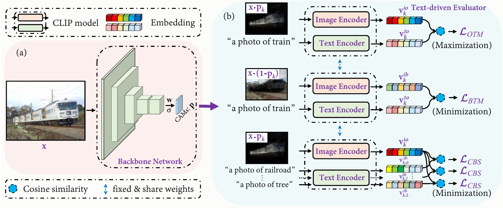

# CLIMS (Camera-ready version)

Code repository for our paper "[CLIMS: Cross Language Image Matching for Weakly Supervised Semantic Segmentation](https://arxiv.org/abs/2203.02668)" in **CVPR 2022**.



Please to **NOTE** that this repository is an **camera-ready version** of our improved version (you can refer to the root directory of `../`)

## Dataset
### PASCAL VOC2012
You will need to download the images (JPEG format) in PASCAL VOC2012 dataset at here. Make sure your `data/VOC2012 folder` is structured as follows:
```
├── VOC2012/
|   ├── Annotations
|   ├── ImageSets
|   ├── SegmentationClass
|   ├── SegmentationClassAug
|   └── SegmentationObject
```

## Training
Please download pre-trained models at [here](https://drive.google.com/drive/folders/1m5oGDLRHmAYDc893dirb-BSLcomEuT2u?usp=sharing) and put it at the directory of `experiments/models/`
1. Train CLIMS on PASCAL V0C2012 dataset
```
OMP_NUM_THREADS=16 CUDA_VISIBLE_DEVICES=0 CUDA_VISIBLE_DEVICES=0 python train_CLIMS.py --experiment clims_voc12
```
2. Generate initial CAMs
```
OMP_NUM_THREADS=16 CUDA_VISIBLE_DEVICES=0 CUDA_VISIBLE_DEVICES=0 python inference_cam.py --tag clims_voc12 --domain train_aug
```
3. Evaluate the quality of initial CAMs
```
python evaluate.py --experiment_name clims_voc12@train@scale=0.5,1.0,1.5,2.0
```
4. Apply random walk to initial CAMs (You can download the pre-trained affinity net model at [here](https://drive.google.com/drive/folders/1m5oGDLRHmAYDc893dirb-BSLcomEuT2u?usp=sharing) and put it at the directory of `experiments/models/AffinityNet@ResNet50.pth`)
```
OMP_NUM_THREADS=16 CUDA_VISIBLE_DEVICES=0 python inference_rw.py --cam_dir clims_voc12@train@scale=0.5,1.0,1.5,2.0 --domain train_aug --model_name AffinityNet@ResNet50
```
5. Make pseudo labels
```
OMP_NUM_THREADS=16 CUDA_VISIBLE_DEVICES=0 python make_pseudo_labels.py --experiment_name AffinityNet@ResNet50@train@beta=10@exp_times=8@rw --domain train_aug --crf_iteration 1
```
6. Evaluate the quality of pseudo labels
```
python evaluate.py --experiment_name AffinityNet@ResNet50@train@beta=10@exp_times=8@rw@crf=1
```

## Evaluation Results
### The quality of initial CAMs and pseudo masks on PASCAL VOC2012.

| Method    | backbone | CAMs | + RW | + IRNet |
|:---------:|:--------:|:----:|:----:|:----:|
| **CLIMS(cvpr)** | R50      | 56.6 | 70.5 | - |

### Evaluation results on PASCAL VOC2012 val and test sets.

| Method    | Supervision | Network  | Pretrained  | val  | test |
|:---------:|:-----------:|:----:|:----:|:----:|:----:|
| AdvCAM    | S           | DeepLabV2 |  ImageNet | 68.1 | 68.0 |
| EDAM      | I+S         | DeepLabV2 |  COCO     | 70.9 | 70.6 |
| **CLIMS(cvpr)** | I     | DeepLabV2 |  ImageNet | 69.3 | 68.7 |
| **CLIMS(cvpr)** | I     | DeepLabV2 |  COCO     | 70.4 | 70.0 |

(Initial CAMs, pseudo semantic masks, and pre-trained models of camera-ready version can be found at [Google Drive](https://drive.google.com/drive/folders/1njCaolWacqSmw7HVNecwvCAMm7NsCFPq?usp=sharing))

If you are using our code, please consider citing our paper.

```
@article{xie2022cross,
  title={Cross Language Image Matching for Weakly Supervised Semantic Segmentation},
  author={Xie, Jinheng and Hou, Xianxu and Ye, Kai and Shen, Linlin},
  journal={arXiv preprint arXiv:2203.02668},
  year={2022}
}
```
This repository was highly based on [PuzzleCAM](https://github.com/OFRIN/PuzzleCAM), thanks for Sanghyun Jo's great code.